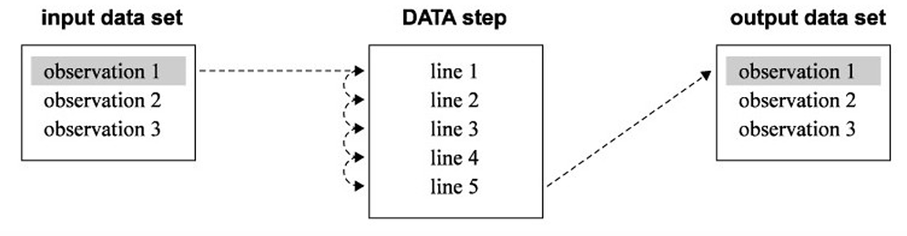

# All You Need to Know about SAS

## 1 Introduction

### 1.1 The SAS Language

Unlike many ohter software applications which are either menu driven, or command driven, SAS uses statements to write a series of instructions called a SAS program.

A SAS program is a sequence of statements executed in order. A statement gives information or instructions to SAS and must be appropriately placed in the program. The order of the subsequent statements may not be important, but you must start with the general statement of what you want to do, such as two basic building blocks: `DATA` steps and `PROC` steps.

As with any language, there are a few rules to follow when writing SAS programs. The most important rule is **Every SAS statement ends with a semicolon**.

There really aren't any rules about how to format your SAS program. While it is helpful to have a neat looking program with each statement on a line by itself and indentions to show the various parts of the program, it isn't necessary.

* SAS statements can be in upper- or lowercase, (similar to SQL).
* Statements can continue on the next line.
* Statements can be on the same line as other statements. (You can write several statements on a single line, as long as you put a semicolon in the middle of two statements).
* Statements can start in any column, (different from Python).

To make your programs more understandable, you can insert comments into your programs. There are two styles of comments you can use: one starts with an asterisk (\*) and ends with a semicolon (;). The other style starts with a slash asterisk (/\*) and ends with an asterisk slash (\*/).

```sas
* This is a comment;
/* This is also a comment*/
```

Since some operating environments interpret a slash asterisk (/\*) in the first column as the end of a job, be careful when using this style of comment not to place it in the first column.

### 1.2 SAS Data Sets

Data, of course, are the primary constituent of any data set. In traditional SAS terminology the data consist of variables and observations. Adopting the terminology of relational databases, SAS data sets are also called tables, observations are also called rows, and variables are also called columns.

Raw data come in many different forms, but SAS simplifies this. In SAS there are just two data types: numeric and character. Numeric variables can be added and subtracted, can have any number of decimal places, and can be positive or negative.  In addition, numeric variables can contain plus signs (+), minus signs (-), decimal points (.), or "E" for scientific notation. Character data are everything else. They may contain numerals, letters, or special characters (such as \$ or !), and can be up to 32,767 characters long.

If a variable contains letters or special characters, it must be a character variable. However, if it contains only numbers, then it may be numeric or character.

Sometimes despite your best efforts, your data may be incomplete. The value of a particular variable may be missing for some observations. In those cases, missing character data are represented by blanks, and missing numeric data are represented by a single period (.).

Prior to SAS 9.1, SAS data sets could contain up to 32,767 variables. Beginning with SAS 9.1, the maximum number of variables in a SAS data set is limited by the resources available on your computer but SAS data sets with more than 32,767 variables cannot be used with earlier versions of SAS. The number of observations, no matter which version of SAS you are using, is limited only by your computer's capacity to handle and store them.

You make up names for the variables in your data and for the data sets themselves. Follow these simple rules when making up names for variables and data set members:

* Names must be 32 characters or fewer in length. 
* Names must start with a letter or an underscore ( _ ).
* Names can contain only letters, numerals, or underscores ( _ ).
* Names can contain upper- and lowercase letters. 

This last point is an important one. SAS is insensitive to case so you can use uppercase, lowercase, or mixed case. For example, `Height`, `HEIGHT`, `height` are considered the same variable in SAS.  However, there is one difference for variable names. SAS remembers the case of the first occurrence of each variable name and uses that case when printing results.

In addition to your actual data, SAS data sets contain information about the data set such as its name, the date that you created it, and the version of SAS you used to create it. SAS also stores information about each variable, including its name, label (if any), type (numeric or character), length (or storage size), and position within the data set. This information is sometimes called the descriptor portion of the data set, and it makes SAS data sets self-documenting.

### 1.3 DATA and PROC Steps

SAS programs are constructed from two basic building blocks: DATA steps and PROC steps. A typical program starts with a DATA step to create a SAS data set and then passes the data to a PROC step for processing.

DATA and PROC steps are made up of statements. A step may have as few as one or as many as hundreds of statements. Most statements work in only one type of step — in DATA steps but not PROC steps, or vice versa. In most cases, DATA steps read and modify data while PROC steps analyze data, perform utility functions, or print reports.

DATA steps start with the `DATA` statement. This keyword is followed by a name that you make up for a SAS data set.  In addition to reading data from external, raw data files, DATA steps can include DO loops, IF-THEN/ELSE logic, and a large assortment of numeric and character functions. DATA steps can also combine data sets in just about any way you want, including concatenation and match-merge.

Procedures, on the other hand, start with a `PROC` statement in which the keyword is followed by the name of the procedure (PRINT, SORT, or MEANS, for example). SAS procedures do everything from simple sorting and printing to analysis of variance and 3D graphics.

A step ends when SAS encounters a new step(marked by a `DATA` or `PROC` statement); a `RUN`, `QUIT`, `STOP`, or `ABORT` statement; or, if you are running in batch mode, the end of the program. RUN statements tell SAS to run all the preceding lines of the step and are among those rare, global statements that are not part of a DATA or PROC step.

### 1.4 The DATA Step's Built-in Loop

DATA steps have an underlying structure, an implicit, built-in loop. **DATA steps execute line by line and observation by observation**. The idea that DATA steps execute line by line is fairly straightforward and easy to understand. It means that, by default, SAS executes line one of your DATA step before it executes line two, and line two before line three, and so on. The idea that DATA steps execute observation by observation means SAS takes the first observation and runs it all the way through the DATA step (line by line, of course) before looping back to pick up the second observation. In this way, SAS sees only one observation at a time.

This diagram illustrates how an observation flows through a DATA step:



SAS reads observation number one and processes it using line one of the DATA step, then line two, and so on until SAS reaches the end of the DATA step. Then SAS writes the observation in the output data set. This diagram10shows the first execution of the line-by-line loop. Once SAS finishes with the first observation, it loops back to the top of the DATA step and picks up observation two. When SAS reaches the last observation, it automatically stops.

Apart from that, SAS offers a number of ways to override the line-by-line and observation-by-observation structure. These include the `RETAIN` statement, and the `OUTPUT` statement.

## 2 Getting Your Data into SAS

### 2.1 Telling SAS Where to Find Your Raw Data

If your data are in raw data files (also referred to as text, ASCII, sequential, or flat files), using the DATA step to read the data gives you the most flexibility. Your raw data may be either internal (also called instream) to your SAS program, or in a separate file. Either way, you must tell SAS where to find your data.

#### Internal Raw Data

If you type raw data directly in your SAS program, then the data are internal to your program. You may want to do this when you have small amounts of data, or when you are testing a program with a small test data set. Use the `DATALINES` statement to indicate internal data. The `DATALINES` statement must be the last statement in the DATA step. All lines in the SAS program following the `DATALINES` statement are considered data until SAS encounters a semicolon.

```sas
*  Read internal data into SAS data set called student;
DATA student;
	INPUT Name $ Gender $ ID;
	DATALINES;
Alex M 1910144
Bill M 1910116
Cindy F 1910233
	;
RUN;
```

#### External Raw Data Files

Usually you will want to keep data in external files, separating the data from the program. This eliminates the chance that data will accidentally be altered when you are editing your SAS program. Use the `INFILE` statement to tell SAS the filename and path, if appropriate, of the external file containing the data. The `INFILE` statement follows the `DATA` statement and must precede the `INPUT` statement. After the `INFILE` keyword, the file path and name are enclosed in quotation marks.

```sas
* Examples from several operating environments;

* Windows;          
INFILE 'c:\MyDir\student.dat'; 
* UNIX;
INFILE '/home/mydir/president.dat'; 
* z/OS;
INFILE 'MYID.STUDENT.DAT'; 
```

Suppose the following data are in a file called student1.dat in the directory RawData:

```txt
Alex M 1910144
Bill M 1910116
Cindy F 1910233
```

The following program shows the use of the INFILE statement to read the external data file: 

```sas
* Read data from external file into SAS data set;
DATA student;
    INFILE 'C://RawData/student.dat';
    INPUT Name $ Gender $ ID;
RUN;
```

### 2.2 Reading Raw Data Separated by Space

If the values in your raw data file are all separated by at least one space, then using list input (also called free formatted input) to read the data may be appropriate. List input is an easy way to read raw data into SAS, but with ease come a few limitations. You must read all the data in a record—no skipping over unwanted values. Any missing data must be indicated with a period. Character data, if present, must be simple: no embedded spaces, and no values greater than 8 characters in length. If the data file contains dates or other values which need special treatment, then list input may not be appropriate.

The `INPUT` statement, which is part of the DATA step, tells SAS how to read your raw data. To write an `INPUT` statement using list input, simply list the variable names after the `INPUT` keyword in the order they appear in the data file. Generally, variable names must be 32 characters or fewer, start with a letter or an underscore, and contain only letters, underscores, or numerals. If the values are character (not numeric), then place a dollar sign ( \$ ) after the variable name. Leave at least one space between names.

Suppose the following data are in a file called student2.dat in the directory RawData. This file contains students' scores of three courses.

```txt
Alex 97 98 93
Bill 99 .
92
Cindy 94 . .
Denny . 90 91
```

This data file does not look very neat, but it does meet all the requirements for list input: the character data are 8 characters or fewer and have no embedded spaces, all values are separated by at least one space, and missing data are indicated by a period. Notice that the data for student Bill have spilled over to the next data line. This is not a problem since, by default SAS will go to the next data line to read more data if there are more variables in the `INPUT` statement than there are values in the data line.

```sas
DATA score;
	INFILE 'C://RawData/student.dat';
	INPUT Name $ Calculus Algebra Stats;
RUN;

* Print the data to make sure the file was correctly read;
PROC PRINT DATA = score;
	TITLE 'SAS Data Set score';
RUN;
```

The variables Name, Calculus, Algebra, and Stats are listed after the keyword `INPUT` in the same order as they appear in the file. A dollar sign ( \$ ) after Name indicates that it is a character variable; all the other variables are numeric. A `PROC PRINT` statement is used to print the data values after reading them to make sure they are correct. The `TITLE` statement after the `PROC PRINT` tells SAS to put the text enclosed in quotation marks on the top of each page of output. If you had no `TITLE` statement in your program, SAS would put the words "The SAS System" at the top of each page.

### 2.3 Reading Raw Data Arranged in Columns

Some raw data files do not have spaces (or other delimiters) between all the values or periods for missing data — so the files can't be read using list input. But if each of the variable's values is always found in the same place in the data line, then you can use column input as long as all the values are character or standard numeric. Standard numeric data contain only numerals, decimal points, plus and minus signs, and E for scientific notation. Numbers with embedded commas or dates, for example, are not standard.

Column input has the following advantages over list input: Spaces are not required between values; Missing values can be left blank; Character data can have embedded spaces; You can skip unwanted variables.

With column input, the `INPUT` statement takes the following form. After the `INPUT` keyword, list the first variable's name. If the variable is character, leave a space; then place a \$. After the \$, or variable name if it is numeric, leave a space; then list the column or range of columns for that variable. The columns are positions of the characters or numbers in the data line.

This is a data set that contains four students' score of a course. It has three variables: Name, Department and score. A column ruler showing the column numbers has been placed above the data, just for reference. 

```txt
----+----1----+----2----+----3
Alex     Biostatistics 97
Bill                   97
Cindy    Epidemiology  95
Denny    Data Science  96
```

```sas
DATA score;
	INFILE 'C://RawData/student3.dat';
	INPUT Name $ 1-9 Department $ 10-23 score 24-25;
RUN;

* Print the data to make sure the file was correctly read;
PROC PRINT DATA = score;
	TITLE 'SAS Data Set score';
RUN;
```


### 2.4 Reading Raw Data Not in Standard Format

Sometimes raw data are not straightforward numeric or character. In SAS, informats are used to tell the computer how to interpret these types of data.

There are three general types of informats: character, numeric, and date. The three types of informats have the following general forms:

|   Character  |   Numeric   |    Date    |
|:------------:|:-----------:|:----------:|
| $ informatw. | informatw.d | informatw. |

The \$ indicates character informats, w is the total width, and d is the number of decimal places (numeric informats only). The period is a very important part of the informat name. Without a period, SAS may try to interpret the informat as a variable name, which by default, cannot contain any special characters except the underscore. Two informats do not have names: `$w.`, which reads standard character data, and `w.d`, which reads standard numeric data.

This is an example about the information of four students. It has four variables, Name, Department, Birthdate, and Score for a course. The columns read for each variable are determined by the starting point and the width of the informat. SAS always starts with the first column; so the data values for the first variable, Name, which has an informat of `$9.`, are in columns 1 through 9.  Now the starting point for the second variable is column 10, and SAS reads values for Department in columns 10 through 23. The values for the Birthdate, start in column 24 and are in a date form. Lastly, the values for Score, are in columns 35 through 38. The four columns include the decimal place and the decimal point itself.

```txt
Alex     Biostatistics 01-12-2001 97.0
Bill     Statistics    07-01-2002 92.4
Cindy    Epidemiology  12-08-2000 95.2
Denny    Data Science  02-01-2001 96.8
```

```sas
* Create a SAS data set named score;
* Read the file student4.dat using formatted input;
DATA score;
	INFILE mypath('student4.dat');
	INPUT Name $9. Department $14. Birthdate MMDDYY10. +1 Score 4.1;
RUN;

* Print the data set to make sure the file was correctly read;
PROC PRINT DATA = score;
	TITLE 'SAS Data Set score';
RUN;
```

Notice that the `+1` skips over one column. The output of the variable Birthdate seems weird. For example, the date "01-12-2001" has an output 14987.  This is the number of days since Jan 1, 1960. This number is referred to as a SAS date value.